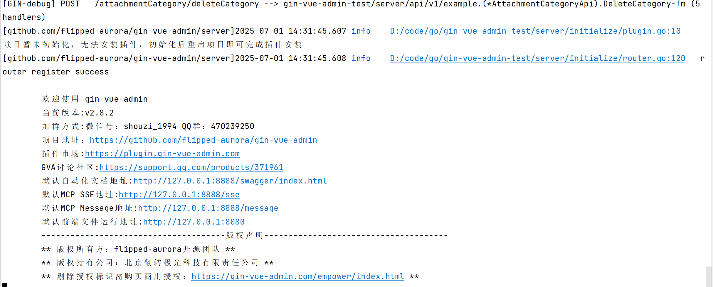
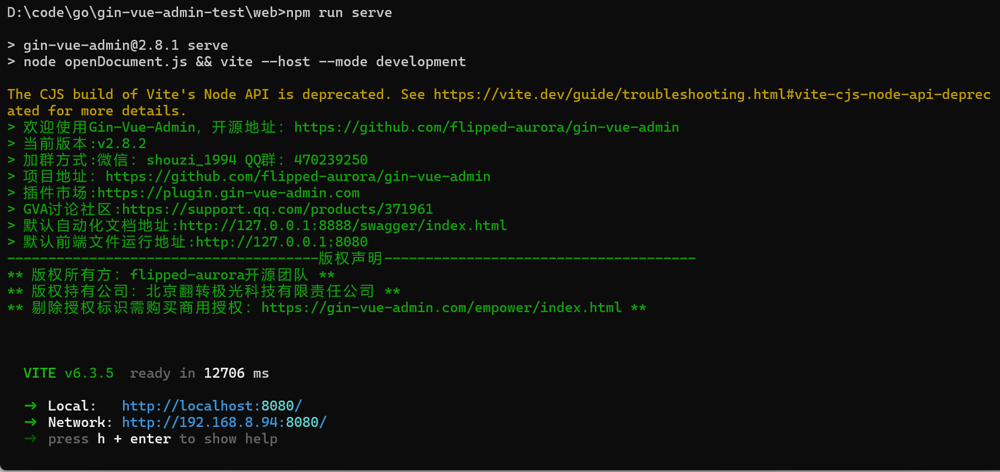

```bash


# 进入server文件夹
cd server

# 使用 go mod 并安装go依赖包
go generate

# 运行
go run . 

```

[gin-vue-admin](https://github.com/flipped-aurora/gin-vue-admin.git)项目快速启动教程


# 一、启动后端

1. 克隆项目
    git clone https://github.com/flipped-aurora/gin-vue-admin.git
2. 进入 [server](server) 文件夹里面，
    先将`server`重命名为`gin-vue-admin`，这个就是golang的后端项目主文件夹了

3. 修改为新的模块名
   修改go.mod，这个文件指定的模块都是github.com/flipped-aurora/gin-vue-admin，不适用于我们本地启动
将
```go
module github.com/flipped-aurora/gin-vue-admin/server

go 1.23

toolchain go1.23.9
``` 
替换为
```go
module gin-vue-admin

go 1.24.0
```
   接着命令行执行：`go mod tidy`
4. 启动
    运行 [main.go](server%2Fmain.go) ，
    启动的时候发生一些报错如下：
[get_nickname.go](server%2Fmcp%2Fget_nickname.go)
```go
    // 1. 参数验证
   argsMap, ok := request.Params.Arguments.(map[string]any)
   username, ok := argsMap["username"].(string)

    // 2. 记录操作日志
    global.GVA_LOG.Info("getNickname工具被调用", zap.String("username", username))

    global.GVA_LOG.Error("数据库查询错误", zap.String("error", err.Error()))
```

还有一些其他的导包错误，自行调整

5. 数据库配置


6. 启动main方法
   发现没有配置文件了，所以将[config.yaml](server%2Fconfig.yaml)文件复制到go mod根路径，并改名为[config.debug.yaml](gin-vue-admin%2Fconfig.debug.yaml)


6. 登录页面
    admin,123456


[sys_user.go](server%2Fservice%2Fsystem%2Fsys_user.go)下面出现了，没有初始化数据库的问题

点击下图中的“前往初始化”


```go
	if nil == global.GVA_DB {
		return nil, fmt.Errorf("db not init")
	}
```
接着是没有用户
INSERT INTO `gin-vue-admin-test`.sys_users (id, created_at, updated_at, deleted_at, uuid, username, password, nick_name, header_img, authority_id, phone, email, enable, origin_setting) VALUES (1, null, null, null, '422ea638-7c53-4c7c-8b02-e2c869943723', 'admin', '$2a$10$GjylQVrrKfUEllCaewg.4u1C.hssO9l2H.dvtYjGION55kDl1Lif6', 'Mr.奇淼', 'https://qmplusimg.henrongyi.top/gva_header.jpg', 888, '17611111111', '333333333@qq.com', 1, null);
INSERT INTO `gin-vue-admin-test`.sys_users (id, created_at, updated_at, deleted_at, uuid, username, password, nick_name, header_img, authority_id, phone, email, enable, origin_setting) VALUES (2, null, null, null, 'cb911fd9-ae65-42fc-8c4a-81d15c077094', 'a303176530', '$2a$10$V.zlfZCgx9XQVCIEjZDs8OHqU4g5kaJ/V9J64CqvNYfLUUjRHfNOq', '用户1', 'https:///qmplusimg.henrongyi.top/1572075907logo.png', 9528, '17611111111', '333333333@qq.com', 1, null);

接着是没有权限


7. 

# 二、启动前端
```bash
# 进入web文件夹
cd web

# 安装依赖
npm install

# 启动web项目
npm run serve
```
